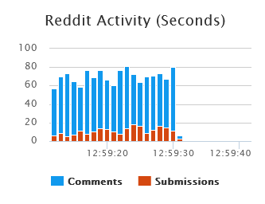
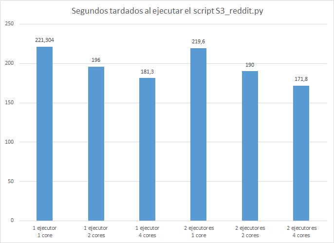

   

## Contenido

1. [El problema](#1-el-problema)
2. [Necesidad de Big Data](#2-necesidad-de-big-data)
3. [La solución](#3-la-solución)
   - [\[S1\] Franja horaria donde se consigue mayor puntuación](./resultado?r=s1)
   - [\[S2\] Franja horaria donde se consigue mayor puntuación en cada subreddit](./resultado?r=s2)
   - [\[S3\] Número de posts por dia y por subreddit](./resultado?r=s3)
   - [\[S4\] Número de palabras que tiene el contenido de los 100 post con mayor puntuación](./resultado?r=s4)
   - [\[S5\] Número de palabras que tienen los 100 post más votados en su título](./resultado?r=s5)
   - [\[S6\] Número de posts en todo Reddit etiquetado cómo nsfw (Mayor de 18 años)](./resultado?r=s6)
   - [\[S7\] Número de posts de cada subreddit etiquetados cómo nsfw (Mayor de 18 años)](./resultado?r=s7)
   - [\[S8\] Los 10 subreddits con mayor puntuación](./resultado?r=s8)
   - [\[S9\] Los 10 subreddits con más comentarios](./resultado?r=s9)
   - [\[S10\] Relación de puntuación y número de comentarios de cada subreddit](./resultado?r=s10)
   - [\[S11\] Usuario que más ha posteado en cada subreddit](./resultado?r=s11)
4. [Trabajo existente relacionado](#4-trabajo-existente-relacionado)
5. [Descripción del modelo y los datos](#5-descripción-del-modelo-y-los-datos)
6. [Infraestructura, modelos de programación y plataformas](#6-infraestructura-modelos-de-programación-y-plataformas)
7. [Explicación del código y como usarlo](#7-explicación-del-código-y-como-usarlo)
8. [Evaluación del rendimiento](#8-evaluación-del-rendimiento)
9. [Dificultades y optimizaciones](#9-dificultades-y-optimizaciones)
10. [Logros y próximos objetivos](#10-logros-y-próximos-objetivos)

## 1. El problema

Nuestro proyecto consiste en el análisis de la página web de agregación de contenido Reddit. La plataforma sirve para publicar y leer contenido de diferentes temáticas.  Los usuarios de Reddit son tanto creadores cómo consumidores del contenido alojado en la página.

El sitio web está compuesto por comunidades individuales conocidas cómo subreddits. Dentro de cada subreddit se publican post relacionados que giran entorno a una temática. Se puede interactuar con estos posts principalmente publicando un comentario y dejando un voto positivo o negativo, obteniendo el post asi interacciones y valoraciones de los usuarios.

Reddit engloba todo tipo de contenidos: vídeos, imágenes, enlaces, textos,etc… Es como una especie de foro dividido en subforos de todo tipo de temáticas donde los usuarios pueden comentar y votar posts realizados por otros usuarios.

En Reddit se genera una cantidad enorme y dispersa de información sobre todo tipo de temáticas. Por eso, para realizar un análisis del contenido es necesario utilizar Big Data.

## 2. Necesidad de Big Data

Cómo consecuencia de la enorme actividad de Reddit, se generan constantemente y a grandes velocidades muchísimos datos. Por eso, encontramos necesario realizar procesamiento Big Data para obtener información de gran utilidad.

Se pueden llegar a crear hasta 80 comentarios por segundo, y hasta 20 posts. Por poner un ejemplo, solo el mes de Enero del dataset utilizado ocupa 4 GB comprimido y 47 descomprimido.

   

Además, aprovechando el procesamiento de datos en paralelo podemos conseguir que dicho procesamiento se realice de manera mucho más efectiva y rápida utilizando el servicio EMR proporcionado por Amazon.

## 3. La solución

Para abordar la solución hemos utilizado cómo lenguaje de programación Python y el framework Spark para procesar datos distribuidos junto a Hadoop.

Hemos diseñado varias utilidades que proporcionan información relevante acerca del contenido publicado en Reddit en meses anteriores. Principalmente nos hemos enfocado en extraer información de los subreddits más populares y sus características. También hemos desarrollado scripts más generales que contemplan todos los subreddits, no sólo los más populares. Las funcionalidades desarrolladas obtienen la siguiente información para el mes de Enero de 2019:

- [\[S1\] La franja horaria donde se consigue mayor puntuación](./resultado?r=s1)
- [\[S2\] La franja horaria donde se consigue mayor puntuación en cada subreddit](./resultado?r=s2)
- [\[S3\] El número de posts por dia y por subreddit](./resultado?r=s3)
- [\[S4\] El número de palabras que tiene el contenido de los 100 post con mayor puntuación](./resultado?r=s4)
- [\[S5\] El número de palabras que tiene el título de los 100 post con mayor puntuación](./resultado?r=s5)
- [\[S6\] El número de posts en todo Reddit etiquetado cómo nsfw (Mayor de 18 años)](./resultado?r=s6)
- [\[S7\] El número de posts de cada subreddit etiquetados cómo nsfw (Mayor de 18 años)](./resultado?r=s7)
- [\[S8\] Los 10 subreddits con mayor puntuación](./resultado?r=s8)
- [\[S9\] Los 10 subreddits con mayor número de comentarios](./resultado?r=s9)
- [\[S10\] La relación de puntuación y número de comentarios de cada subreddit](./resultado?r=s10)
- [\[S11\] El usuario que más ha posteado en cada subreddit](./resultado?r=s11)

La información producida por los scripts desarrollados, la mostramos en diferentes gráficos realizados con las librerías de Javascript [amcharts](https://www.amcharts.com/) y [flourish studio](https://flourish.studio/). Estas librerías permiten visualizar gráficas interactivas con un gran dinamismo y bonita apariencia a partir de los resultados de los scripts.

## 4. Trabajo existente relacionado

La propia página de agregación de contenido ofrece la posibilidad de ver los posts y subreddits que son relevantes en la actualidad, pero no muestra los de días anteriores. Esta funcionalidad puede ser útil para los usuarios que utilizan a diario la plataforma pero no proporcionan un análisis más allá del momento actual.

Además existe la página [subredditstats](https://subredditstats.com/), que muestra algunas estadísticas actuales de los subreddits. Esta información que nos ofrece es útil pero tiene algunas limitaciones en nuestra opinión, ya que son estadísticas muy generales y no muestran estadísticas de fechas anteriores. 

##  5. Descripción del modelo y los datos

El dataset utilizado ha sido descargado desde [pushshift.io](https://pushshift.io/). La filosofía de pushshift.io es simple, agregar todo el contenido que existe de reddit en un dataset para poder trabajar con los datos usando técnicas de Big Data.

   

[Aquí](https://files.pushshift.io/reddit/) está el directorio de contenido donde se encuentra nuestro dataset entre muchos otros y el [enlace directo al dataset](https://files.pushshift.io/reddit/submissions/RS_2019-01.zst).

En reddit los dos elementos principales son: posts y comentarios. En nuestro análisis hemos utilizado posts. Un post tiene campos como:

- `title`: titulo del post.
- `author`: el autor del post
- `created`: fecha de creación
- `subreddit`: subreddit al que pertenece
- `num_comments`: número de comentarios
- `score`: puntuación del post
- ...

Cada post tiene muchos más campos que estos que se pueden revisar descargando una muestra del dataset aquí. Además en esta página de documentación se ofrece una explicación más detallada de la mayoría de estos.

En el repositiorio de Github tenemos un [fichero en formato JSON](https://github.com/beybo/ProyectoRedditCloud/blob/main/ficheros/EjemploFila.json) con todos los campos que puede tener un post que se ha extraido del dataset de pushshift.io.

## 6. Infraestructura, modelos de programación y plataformas

En cuanto a la infraestructura se ha utilizado un cluster `m4x.large` de AWS, de un nodo master y otros dos workers, proporcionado por el servicio de EMR de AWS.

El modelo de programación utilizado es el brindado por el framework `Spark 2.4.4` utilizando el lenguaje Python y además haciendo uso del framework `Hadoop 2.8.5 YARN`.

Para el almacenamiento del dataset hemos utilizado también un cubo del servicio S3 de AWS.

## 7. Explicación del código y como usarlo

Si deseas probar el código, pincha [aquí](https://github.com/beybo/ProyectoRedditCloud/blob/main/README.md) para acceder a las instrucciones colgadas en el repositorio del proyecto.

## 8. Evaluación del rendimiento

A continuación detallamos una tabla con el número de nodos y ejecutores y el tiempo que ha llevado la ejecución del script S3_reddit.py en un cluster m4x.large:

| Número de Ejecutores | Número de Cores | Tiempo |
|:-------------|:------------------|:------|
|1|1|3m41.304s|
|1|2|3m16.283s|
|1|4|3m1.252s|
|2|1|3m39.638s|
|2|2|3m10.456s|
|2|4|2m51.837s|

   

## 9. Dificultades y optimizaciones 

Uno de los aspectos más desafiantes de la implementación y paralelización ha sido el de trabajar con un dataset de 50GB.

No solo tuvimos que implementar el código intentando optimizar los recursos de memoria disponibles (por ejemplo realizando SELECTS de solo los datos necesarios en cada etapa del pipeline en vez de seleccionar todo), también tuvimos que realizar varias pruebas en diferentes máquinas para encontrar la que más se ajustaba en cuanto a rendimiento y coste.

Otra técnica para la mejora del rendimiento que realizamos fue aumentar la memoria de Spark a 9486MB modificando un parámetro del archivo de configuración ubicado en `/etc/spark/conf.dist/spark-defaults.conf spark.driver.memory`  

## 10. Logros y próximos objetivos

Reflexionando sobre los objetivos alcanzados, creemos que hemos realizado con éxito un estudio que ofrece una visión interesante y curiosa sobre los posts del mes de Enero de 2019 de Reddit. Además para hacer algo diferente y ofrecer una experiencia más interactiva hemos logrado mostrar el resultado mediante una serie de gráficas interactivas gracias a las librerías amcharts y flourish studio.

Hemos aprendido mucho sobre la cantidad de poder computacional necesaria para trabajar con este tipo de datasets de gran tamaño. Al elegir un dataset de casi 50GB pudimos experimentar de primera mano las dificultades que conlleva trabajar con una cantidad enorme de datos.  Algunas de estas dificultades han sido: seleccionar pequeñas muestras de datos para poder trabajar de manera local, realizar alguna optimización tanto de código como de configuraciones para conseguir que funcionara todo correctamente, hacer pruebas para comprobar el rendimiento de la infraestructura entre otras.

Hemos pensado que una opción interesante para el futuro, además de realizar otros tipos de estudios sobre el dataset, podría ser la implementación de algún modelo de Machine Learning con la que podamos usar los conocimientos obtenidos en este proyecto para predecir la puntuación de un post. También resultaría interesante juntar todos los dataset de pushift.io de reddit para realizar un estudio más general de Reddit.
